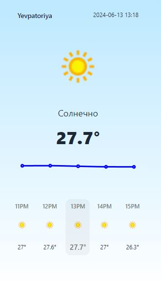
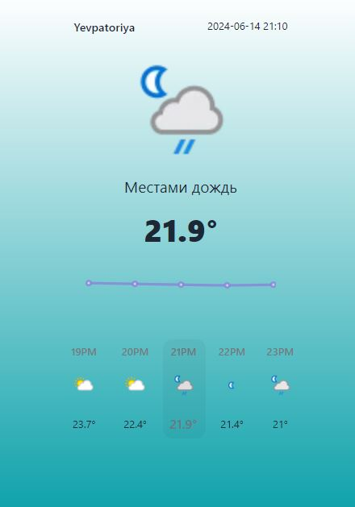

# Frontend для приложения Weather

## Описание проекта

Мобильное приложение для просмотра погоды в выбранном городе

## Используемые технологии

- ⚛️ [React](https://ru.reactjs.org/)
- 🔧 [Redux](https://ru.reduxjs.org/)

## Библиотеки,которые использовались

1. axios

## Сведения о команде:

1. Сидорчук Николай - Профиль на GitHub [https://github.com/k0t1k777](https://github.com/k0t1k777)
2. Тятых Юрий - Профиль на GitHub [https://github.com/YuriyTyatykh](https://github.com/YuriyTyatykh)

## ссылка на Github Pages

Ссылка: [https://k0t1k777.github.io/Weather/](https://k0t1k777.github.io/Weather/)

## Инструкции по установке и запуску

1. Клонируйте репозиторий: `git clone git@github.com:k0t1k777/Weather.git`
2. Перейдите в директорию проекта: `cd Weather`
3. Установите зависимости: `npm install`
4. Запустите проект: `npm run dev`
5. В браузере открываем `http://localhost:5173/`

Или

1. Переходим по этой ссылке: `https://github.com/k0t1k777/Weather`
2. Нажимаем `Code`
3. Нажимаем `Download ZIP`
4. Распаковываем скачанный архив в любое удобное место
5. Заходим в `Visual Studio Code`, в разделе `Файл` выбираем `Открыть папку`, выбираем распакованную папку, жмём `Ok`
6. В разделе `Терминал` выбираем `Создать терминал`
7. Пишем в терминале: `cd Weather`
8. Установка зависимости: `npm install`
9. Запуск проект: `npm run dev`
10. В браузере открываем `http://localhost:5173/`

## Ключевые точки для медиа min,max-width: 320px

Колян красавчик, клевый разработчик, но картинки так и не пофиксил =)